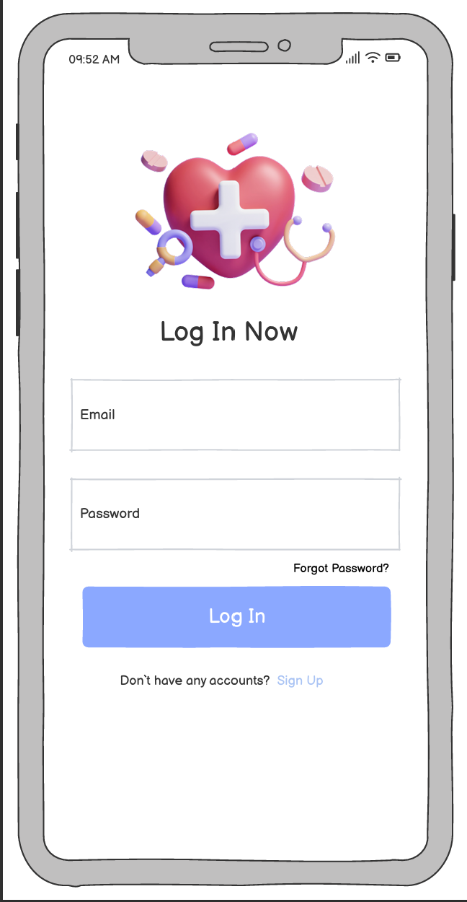
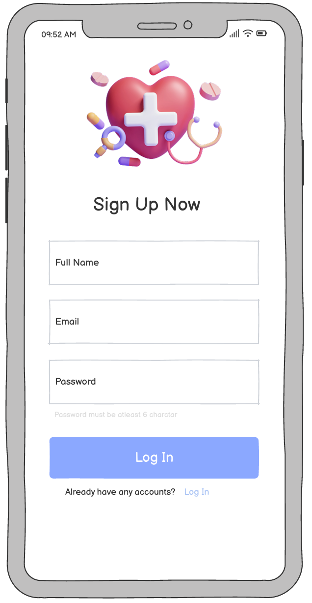
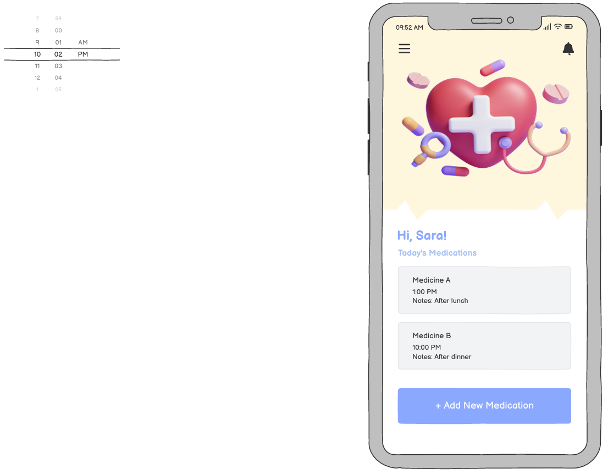
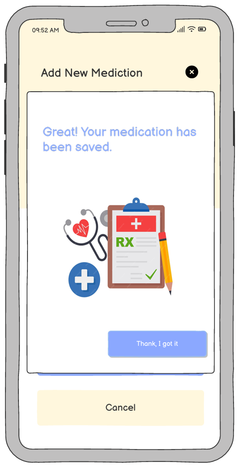

# Medication Reminder Mobile Application – UX Case Study

## Project Overview  
This was a collaborative academic project focused on designing and evaluating a medication reminder mobile application for elderly users using HCI principles and usability heuristics.  
Developed as part of Human-Computer Interaction Course.

---

## Problem  
Elderly users often struggle with medication adherence due to memory challenges, multiple daily medications, low digital familiarity, and visual limitations.  
The goal was to design a simple and accessible reminder system tailored to this group.

---

## Design & Prototype  
The prototype included:
- Login / Sign-Up  
- Home (daily medications)  
- Add Medication  
- Profile  
- Notifications  
- Confirmation screen  

An interactive prototype was created using Balsamiq.  
[View Full Project Prototype](Medication_Reminder_UX_Prototype.pdf)

---

## Evaluation (My Main Contribution)

### Method  
The prototype was tested with **3 elderly participants (ages 58–71)** using task-based usability testing and direct observation.  
Tasks included logging in, navigating the system, adding medication, and saving changes.

---

### Key Findings  
- Low contrast text reduced readability for **2 out of 3 participants**.  
- Small font sizes affected all participants with visual limitations.  
- Abstract icons caused navigation confusion for **2 participants**.  
- Ambiguous confirmation buttons caused hesitation for **2 out of 3 users**.  

Despite these issues, all users completed core tasks successfully.

---

## Conclusion & Improvements  
Proposed improvements include:
- Increasing font size and color contrast  
- Replacing abstract icons with familiar symbols  
- Redesigning confirmation screen with clear labels  
- Adding voice-assisted navigation  
- Expanding usability testing with a larger sample  

---

## My Role  
- Conducted usability testing  
- Recorded and analyzed user behavior  
- Linked findings to academic research  
- Wrote evaluation and conclusion sections  
- Proposed accessibility-focused improvements  

---

## Tools Used  
- Balsamiq  
- Usability Testing (Observation-based)  
- Nielsen’s Usability Heuristics  

---

## Skills Demonstrated  
- Usability Testing  
- UX Evaluation  
- Accessibility Analysis  
- Application of HCI Principles 

This case study demonstrates applied usability evaluation and research-based design improvement within an academic setting.

---

## Key Screens & Observed Usability Issues

### Log In Screen

Observed Issue: Low-contrast "Sign Up" link reduced visibility for elderly users.

### Sign Up Screen

Observed Issue: Low-contrast "Log In" link made it difficult for elderly users to notice.

### Home Screen

Observed Issue: Menu icon was not recognized as a path to Personal Info by elderly users.

### Alter Screen

Observed Issue: Multiple ambiguous buttons caused hesitation and confusion.

---

## Full Documentation

📄 Full Project Report:
[View Full Project Report (PDF)](Medication_Reminder_UX_Report.pdf)
